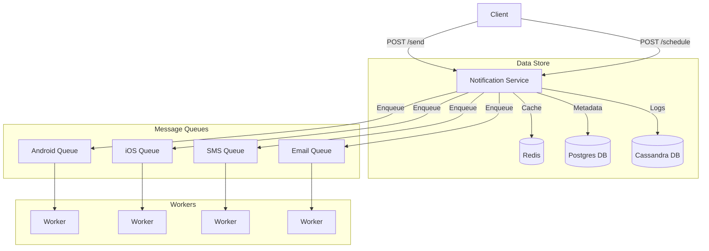

# Notification System Backend

A robust notification service backend built with Spring Boot, serving as a practice project to understand enterprise-level notification architectures.

## Architecture

The system follows a microservices-inspired architecture designed for scale:



The system uses a decoupled architecture:
- **Controllers**: Handle HTTP requests and define API contracts (`*Request`).
- **Services**: Implement core business logic and internal domain models (`*Dto`).
- **Mappers**: Use MapStruct to transform data between layers.
- **Channels**: Modular integration with providers (e.g., Twilio for SMS).

## Tech Stack

- **Java**: 17
- **Framework**: Spring Boot 3.5.6
- **Build Tool**: Maven
- **Database**: PostgreSQL
- **Migration**: Flyway
- **Mapping**: MapStruct
- **Utilities**: Lombok

## Prerequisites

Before running the application, ensure you have:
1.  **Java 17+** installed (`java -version`).
2.  **Maven** installed (`mvn -version`).
3.  **PostgreSQL** running locally or via Docker.
4.  **Twilio Account** (SID, Auth Token, and Phone Number) for SMS features.

## Setup Instructions

### 1. Clone the repository
```bash
git clone https://github.com/kulagodvishal99/notification-service-backend.git
cd notification-service-backend
```

### 2. Configure Database
Create a PostgreSQL database named `notification_system`.
```sql
CREATE DATABASE notification_system;
```

### 3. Environment Configuration
The application relies on environment variables for sensitive secrets. You can set these in your IDE run configuration or export them in your terminal:

| Variable | Description | Default (Dev) |
| :--- | :--- | :--- |
| `DB_URL` | JDBC URL for Postgres | `jdbc:postgresql://localhost:5432/notification_system` |
| `DB_USERNAME` | Database User | `notification_system_user` |
| `DB_PASSWORD` | Database Password | `ChangeMe_Notification1!` |
| `TWILIO_ACCOUNT_SID` | Twilio Account SID | *(Required)* |
| `TWILIO_AUTH_TOKEN` | Twilio Auth Token | *(Required)* |
| `TWILIO_FROM_NUMBER` | Sender Number | *(Required)* |

### 4. Build and Run
```bash
mvn clean install
mvn spring-boot:run
```

## API Usage

### Send SMS
**Endpoint**: `POST /notification-system/notifications/sms/send`

**Request Body**:
```json
{
  "phoneNumber": "+1234567890",
  "message": "Hello from the Notification Service!"
}
```

**cURL Example**:
```bash
curl -X POST http://localhost:8080/notification-system/notifications/sms/send \
  -H "Content-Type: application/json" \
  -d '{
    "phoneNumber": "+15550109988",
    "message": "Test notification"
  }'
```

## Project Structure

```
src/main/java/org/example/notifications/
├── controllers/          # REST Controllers & API Requests
│   └── dtos/             # API Data Transfer Objects (*Request)
├── services/             # Business Logic & Channels
│   └── dtos/             # Internal Domain Models (*Dto)
├── mappers/              # MapStruct interfaces
└── repositories/         # JPA Repositories & Entities
```
